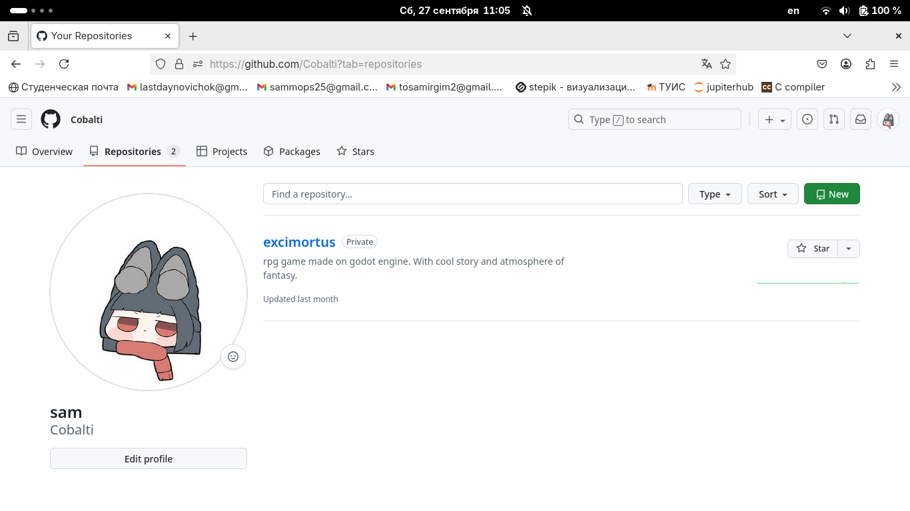
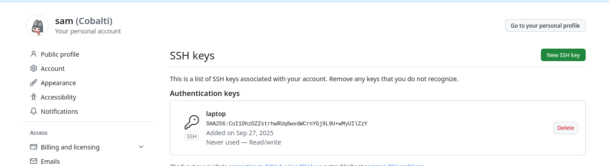

# Лабораторная работа №3. 
# Дисциплина: Архитектура компьютеров и операционные системы. Создание отчета по лабораторной работе №2 В Markdown.

Выполнил: [Галиев Самир Салаватович]  
Группа: [НКАбд-02-25]  
Дата выполнения: [26.10.2025]

## Цель работы

Изучение и применение средств контроля версий, приобретение практических навыков по работе с системой контроля версий Git. 

## Результаты выполнения лабораторной работы

### Описание выполняемого задания

В ходе лабораторной работы необходимо было освоить основные этапы работы с системой контроля версий Git и платформой GitHub:

1. Настройка учетной записи GitHub
2. Базовая настройка Git
3. Создание и настройка SSH-ключей
4. Создание рабочего пространства
5. Работа с удаленным репозиторием

### Скриншоты выполнения заданий

#### Задание 2.1: Настройка учетной записи GitHub

#### Задание 2.2: Базовая настройка Git

#### Задание 2.3: Создание SSH-ключа

#### Задание 2.4: Добавление SSH-ключа в GitHub

#### Задание 2.5: Проверка подключения к GitHub

#### Задание 2.6: Создание рабочего пространства

#### Задание 2.7: Создание репозитория из шаблона

#### Задание 2.8: Клонирование репозитория

#### Задание 2.9: Настройка каталога курса

#### Задание 2.10: Первый коммит и отправка на GitHub

#### Задание 2.11: Проверка на GitHub

### Комментарии и выводы

В процессе выполнения основной части работы:
- Успешно создана и настроена учетная запись GitHub
- Выполнена базовая конфигурация Git с установкой глобальных параметров
- Сгенерирована и настроена пара SSH-ключей для безопасной аутентификации
- Создана корректная иерархическая структура рабочего пространства
- Освоены основные операции работы с удаленным репозиторием (клонирование, коммиты, отправка изменений)

## Результаты выполнения заданий для самостоятельной работы

### Описание задания

1. Создание отчета по лабораторной работе №2 в структуре репозитория
2. Копирование отчета по лабораторной работе №1 в репозиторий
3. Загрузка отчетов на GitHub
4. Проверка корректности отображения загруженных отчетов

### Скриншоты выполнения

#### Задание 3.1: Копирование отчета по лабораторной работе №1

#### Задание 3.2: Загрузка отчетов на GitHub

#### Задание 3.3: Проверка загруженных отчетов

### Комментарии и выводы

Самостоятельная работа выполнена успешно:
- Создана директория для хранения отчета по лабораторной работе №2
- Отчет по лабораторной работе №1 размещен в соответствующей директории репозитория
- Все отчеты успешно синхронизированы с удаленным репозиторием GitHub
- Корректность отображения проверена на сайте GitHub

## Выводы

В ходе выполнения лабораторной работы №2 я успешно изучил и применил средства контроля версий, приобрел практические навыки работы с системой Git. Были освоены ключевые аспекты работы с системой контроля версий, включая настройку окружения, работу с удаленными репозиториями и управление версиями проектов.

## Список литературы

1. **GitHub Documentation** - https://docs.github.com/ru
2. **Git Quick Reference** - https://quickref.me/git
3. **Официальная документация Git** - https://git-scm.com/doc
4. **Ссылка на репозиторий** - https://github.com/Cobalti/study_2025-2026_arch-pc
