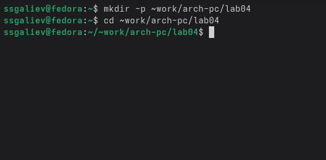
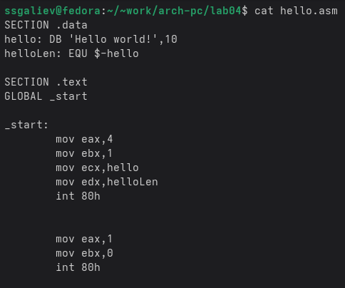
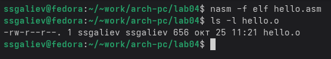
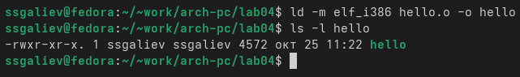
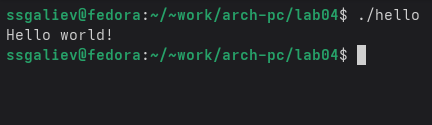
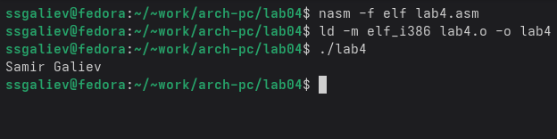
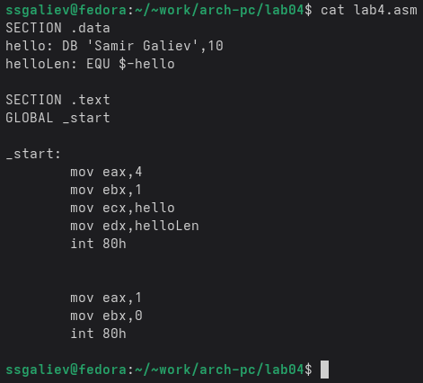
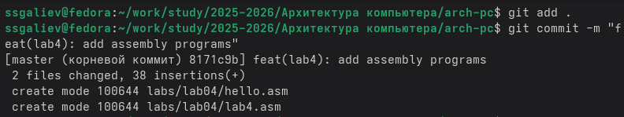
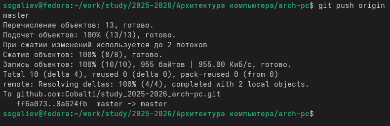
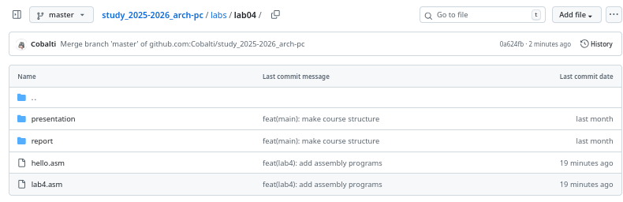

# Лабораторная работа №4. дисциплина: Архитектура компьютеров и операционные системы. Создание и процесс обработки программ на языке ассемблера NASM

Выполнил: [Галиев Самир Салаватович]  
Группа: [НКАбд-02-25]  
Дата выполнения: [25.10.2025]

## Цель работы

Освоение процедуры компиляции и сборки программ, написанных на ассемблере NASM.

## Результаты выполнения лабораторной работы

### Описание выполняемого задания

В ходе лабораторной работы необходимо было:
1. Создать простую программу на языке ассемблера NASM, выводящую на экран сообщение "Hello world!"
2. Освоить процесс трансляции исходного кода с помощью NASM
3. Освоить процесс компоновки объектного файла с помощью LD
4. Запустить и проверить работу исполняемого файла

### Скриншоты выполнения заданий

#### Шаг 1: Создание рабочего каталога


#### Шаг 2: Создание и редактирование hello.asm


#### Шаг 3: Трансляция программы NASM


#### Шаг 4: Компоновка с помощью LD


#### Шаг 5: Запуск программы Hello World


### Комментарии и выводы

В процессе выполнения основной части работы:
1. Успешно создана программа на ассемблере NASM
2. Освоен процесс трансляции и компоновки
3. Программа выводит сообщение "Hello world!"

## Результаты выполнения заданий для самостоятельной работы

### Описание задания

1. Создать копию файла hello.asm с именем lab4.asm
2. Изменить программу для вывода фамилии и имени
3. Провести трансляцию, компоновку и запуск
4. Загрузить файлы на GitHub

### Скриншоты выполнения

#### Шаг 6: Создание lab4.asm и ее запуск


#### Шаг 7: Отредактированный hello.asm для lab4.asm


#### Шаг 8: Загрузка на GitHub




### Листинги программ

hello.asm
```
SECTION .data
hello: DB 'Hello world!',10
helloLen: EQU $-hello

SECTION .text
GLOBAL _start

_start:
    mov eax,4
    mov ebx,1
    mov ecx,hello
    mov edx,helloLen
    int 80h

    mov eax,1
    mov ebx,0
    int 80h
```
### Вывод
В ходе лабораторной работы была освоена процедура компиляции и сборки программ на ассемблере NASM. Изучены этапы трансляции, компоновки и запуска программ.

### Список литературы
1. The NASM Documentation. — URL: https://www.nasm.us/docs.php  
   *Официальная документация ассемблера NASM*

2. Расширенный ассемблер: NASM. — URL: https://www.opennet.ru/docs/RUS/nasm/  
   *Подробное руководство на русском языке*

3. GNU LD Manual. — URL: https://sourceware.org/binutils/docs/ld/  
   *Официальная документация компоновщика LD*

4. NASM Assembly Language Tutorials. — URL: https://asmtutor.com/  
   *Практические уроки по программированию на NASM*

5. Столяров А. Программирование на языке ассемблера NASM для OC Unix. — 2-е изд. — М.: МАКС Пресс, 2011. — URL: http://www.stolyarov.info/books/asm_unix  
   *Учебное пособие по NASM для Unix-систем*
