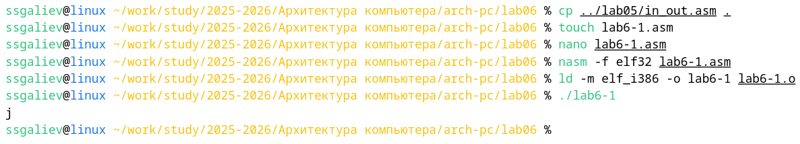
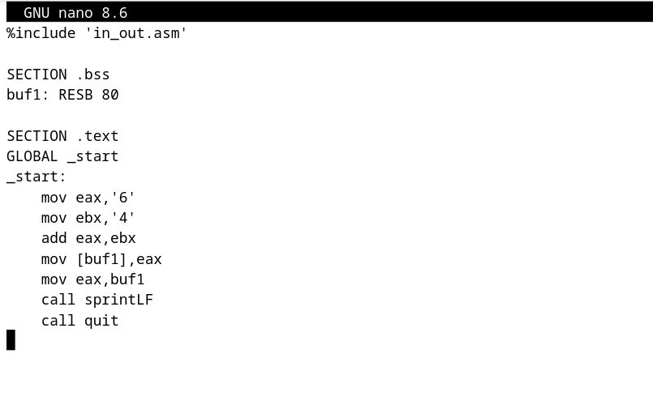
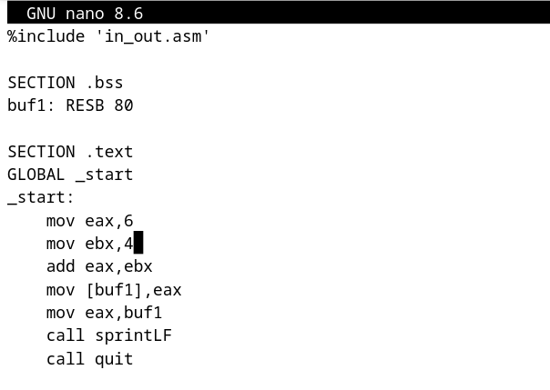
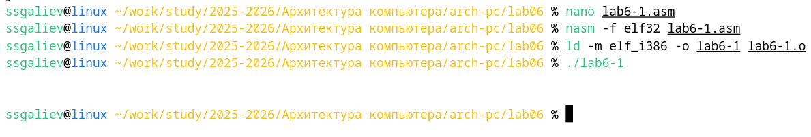
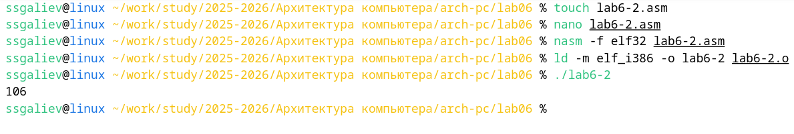
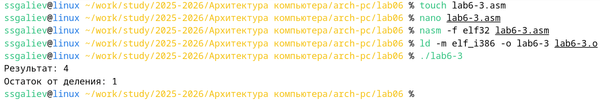

# Лабораторная работа №6. Арифметические операции в NASM

**Выполнил:** [Галиев Самир Салаватович]  
**Группа:** [НКАбд-02-25]  
**Дата выполнения:** [15.11.2025]

---

## Оглавление

- [Цель работы](#цель-работы)
- [Результаты выполнения лабораторной работы](#результаты-выполнения-лабораторной-работы)
  - [Символьные и численные данные в NASM](#символьные-и-численные-данные-в-nasm)
  - [Выполнение арифметических операций](#выполнение-арифметических-операций)
- [Задание для самостоятельной работы](#задание-для-самостоятельной-работы)
- [Выводы](#выводы)
- [Список литературы](#список-литературы)

---

## Цель работы

Освоение арифметических инструкций языка ассемблера NASM.

## Результаты выполнения лабораторной работы

### Символьные и численные данные в NASM

**Задание:** Изучение различий между работой с символьными и численными данными в NASM, освоение преобразования данных.

#### Программа lab6-1.asm - Сложение символьных данных

*Рисунок 1 и 2: Программа lab6-1.asm сложение символьных данных '6' и '4'*

**Комментарий:** Программа складывает символы '6' и '4'. Результат - символ 'j' (код 106), что демонстрирует сложение ASCII-кодов символов.

#### Программа lab6-1.asm - Сложение численных данных

*Рисунок 3 и 4: Программа lab6-1.asm - сложение численных данных 6 и 4*

**Комментарий:** После замены символов на числа программа выводит символ с кодом 10 (перевод строки), так как функция sprintLF интерпретирует числовое значение как ASCII-код.

#### Программа lab6-2.asm - Использование iprintLF

*Рисунок 5: Программа lab6-2.asm с использованием функции iprintLF*

**Описание:** Функция iprintLF корректно выводит числовое значение 106, демонстрируя правильное преобразование числа в строку для вывода.

#### Сравнение iprint и iprintLF

*Рисунок 6: Сравнение работы функций iprint и iprintLF*

**Описание:** На скриншоте видно, что iprintLF добавляет перевод строки после вывода, а iprint выводит число без перевода строки, что может приводить к появлению символа '%' в промпте.

### Выполнение арифметических операций

**Задание:** Освоение арифметических инструкций NASM на примере вычисления выражений.

#### Программа lab6-3.asm - Вычисление выражения

*Рисунок 6: Программа вычисления выражения (5×2+3)/3*

**Описание:** Программа демонстрирует вычисление арифметического выражения с использованием инструкций mul (умножение) и div (деление), выводя результат и остаток от деления.

#### Программа variant.asm - Вычисление варианта

*Рисунок 7: Программа вычисления варианта задания по номеру студенческого билета*

**Описание:** Программа запрашивает номер студенческого билета, вычисляет вариант по формуле (Sn mod 20) + 1 и выводит результат, демонстрируя ввод данных и арифметические операции.

## Задание для самостоятельной работы

**Задание:** Написать программу вычисления выражения \( f(x) = 10(x + 1) - 10 \) для варианта 11.

#### Код программы lab6-4.asm

*Рисунок 8: Исходный код программы для вычисления выражения 10(x + 1) - 10*

**Описание:** Скриншот показывает полный код программы, включающий ввод значения x, вычисление выражения и вывод результата.

#### Тестирование программы

*Рисунок 9: Тестирование программы для значений x=1 и x=7*

**Описание:** Программа протестирована для двух значений:
- При x = 1: 10(1 + 1) - 10 = 10
- При x = 7: 10(7 + 1) - 10 = 70
Результаты соответствуют ожидаемым значениям.

#### Интерактивный запуск

*Рисунок 10: Интерактивный запуск программы с вводом произвольного значения*

**Описание:** Демонстрация работы программы в интерактивном режиме с вводом значения с клавиатуры и выводом вычисленного результата.

## Выводы

В ходе выполнения лабораторной работы были достигнуты следующие результаты:

✅ **Освоены арифметические инструкции NASM** - Практически изучены и применены инструкции add, sub, mul, div, inc для выполнения арифметических операций.

✅ **Изучены различия символьных и численных данных** - Освоено преобразование между символьным и численным представлением данных, понимание работы с ASCII-кодами.

✅ **Реализованы программы вычисления выражений** - Созданы и протестированы программы для вычисления арифметических выражений различной сложности.

✅ **Освоен ввод данных с клавиатуры** - Реализован интерактивный ввод данных с преобразованием ASCII-строк в числа с использованием функции atoi.

✅ **Изучено деление с остатком** - Освоено использование инструкции div для получения частного и остатка от деления.

✅ **Выполнено задание для самостоятельной работы** - Создана и протестирована программа вычисления заданного выражения \( f(x) = 10(x + 1) - 10 \) для различных значений переменной.

**Цель работы достигнута полностью** - освоены арифметические инструкции языка ассемблера NASM и их практическое применение для вычисления выражений различной сложности.

## Список литературы: 
- NASM Assembly Language Tutorials — 2021. — URL: https://asmtutor.com/

- The NASM documentation — 2021. — URL: https://www.nasm.us/docs.php

- Расширенный ассемблер: NASM — 2021. — URL: https://www.opennet.ru/docs/RUS/nasm/

- Столяров А. Программирование на языке ассемблера NASM для OC Unix. — 2-е изд. — М. : MAKC Пресс, 2011. — URL: http://www.stolyarov.info/books/asm_unix
